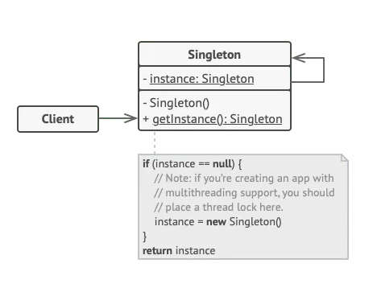

# Design Pattern in Apex

세일즈 포스 개발 측면에서, 효율성과 확장성을 가장 중요한 개발 덕목으로 보는 경우가 많다. 그렇기 때문에 해당 덕목에 맞는 개발 디자인 패턴에 대해서 어느 정도 인지하고 이를 통해 개발하는 것에 대해서 어느정도 익숙해지는 운동을 위해 좋은 장비를 갖고 하는 것처럼 좋은 방법이다.

# APEX 디자인 패턴의 큰 3 분류

## 1. Creational Patterns
> 오브젝트 생성에 책임을 가지고 있는 디자인 패턴. 오브젝트 생성에 대한 방법을 제시해주는 한편, 객체를 마련해주어야 하는 특정한 타입이나 클래스를 추상화시켜줄 수 있다. <b>Creational Pattern</b> 은 언제나 오브젝트의 유연성과 재사용성을 극대화하기 위해서 언제나 오브젝트의 생성에 대한 책임만을 가지고 있다. 통상적인 creational pattern은 다음과 같다:  

1. Singleton pattern(싱글톤 패턴)

2. Factory pattern(팩토리 패턴)

3. Abstract Factory(추상화 팩토리)

4. Builder Pattern(빌더 패턴)

5. Prototype Pattern(프로토 타입 패턴)

## 2. Structual Patterns
> 클래스와 오브젝트가 <b><i>거대한 구조체에 구성되는지</i></b>에 대해서 책임을 가지고 있다. 오브젝트들간의 관계에 대해서 책임을 가지고, 함수에 대한 정의를 유연하고 쉽게 할 수 있도록 지원해준다. 자주 사용되는 패턴으로는 다음과 같이 존재한다.

1. Adapter Pattern

2. Decorator Pattern

3. Composite Pattern 

4. Proxy Pattern

5. Bridge Pattern

## 3. Behavioral Patterns
> Behavioral Patterns는 오브젝트의 상호관계와 책임에 대한 관리를 하고 있디. 오브젝트 간의 데이터 교환에 대해서 패턴을 묘사하고 목적에 따라 코드를 설계할 수 있게끔 도와준다. 자주 사용되는 패턴으로는 다음과 같이 있다.

1. Observer Pattern

2. Strategy Pattern

3. Command Pattern

4. State Pattern

5. Chain of Responsibility Pattern

## Singleton Desired Pattern

Singleton ensures that a class has only one instance sand provides global point of acess to that instance. Regardless of how many times you reques an instance of the singleton class you'll always get the same instance. Aby part of yout app can easily reference and interact with the Singleton instance. 세일즈포스와 같은 multi-tenanat(다대다 관계)에서는 자원을 지나치게 빈번히 사용하는 것은 적절치 못하다.

> 싱글톤 예제

### 세일즈포스에서 실사례 예시
1. Configuration Setting: The singleton pattern is often used to manage configuration settings for Salesforce applications. For example, you might store API integration keys, autherntiaction credentials, or custom applicaiton settings in a Singleton instances. <b>This ensures that configuration data is loaded and available only once throuhghout the application's lifecycle</b>, preventing unnecessary redundant data access. 

2. Governor Limits Management: Singleton can be employed to centralize and manage governor limit tracking, helping developers stay within these limits while executing complex operations. 

3. 

