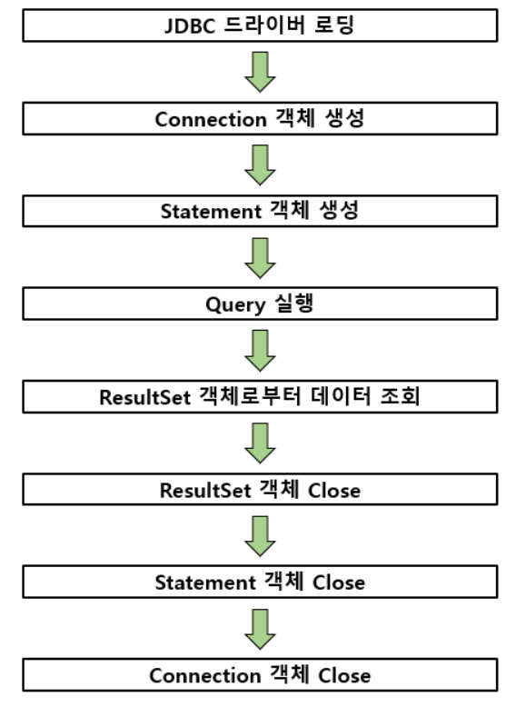

# JDBC 드라이버 접근 순서 정리

인터페이스를 만드는 과정에서 이전에, JAVA 공화국이 들어서면서 Java를 통해서 DB에 접근하는 일이 많아지자, 이 접근을 지원해주는 드라이버를 개발하게 되는데, 해당 드라이버 이름이 Java Database Connectivity(JDBC) 이다. -> 현재는 파이썬에서도 DB 접근을 위해서 JDBC를 파이썬에서 사용할 수 있게 라이브러리로 만들어서 사용이 가능하다.

각설하고, JDBC를 활용해 DB 에 접근하는 인터페이스를 만들 때, 이 작동 원리를 제대로 이용해야 성능이 좌지우지 된다.

# JDBC 프로세스 순서 정리
JDBC는 다음과 같이 8 순서를 거쳐 진행되게 된다.

## JDBC 드라이버 로딩
> 해당 드라이버가 저장되어 잇는 위치에 접근하여 해당 드라이버를 호출한다. 
스크립트를 작성하는 기준으로 얘기를 하면 해당 작업은 통상적으로 1번 진행된다.

## Connection 객체 생성
> DB 커넥션에 필요한 정보를 저장하는 객체를 생성

## Statemnet 객체 생성
> DB Query들을 담을 객체를 생성

## Ruleset
> 주로 ruleset이라는 클래스를 생성해 해당 변수에 쿼리를 저장하는 형태로 쿼리들을 담고 해당 변수들을 호출하는 형태로 쿼리 결과를 활용하거나 호출하는 형태를 한다.

## 객체 Close
> 활용을 마치고 ruleset, Connection 객체를 close한다.

DB에 여러 쿼리를 날리거나 여러 활용이 있다면 statment 보다는 ruleset을 여러번 만들거나 while문을 통해 사용하는 것이 좋다.

