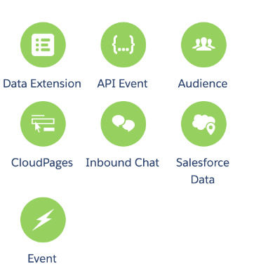
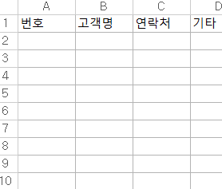
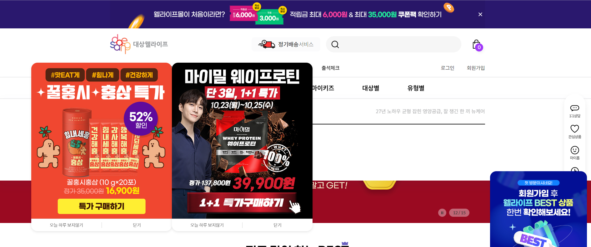
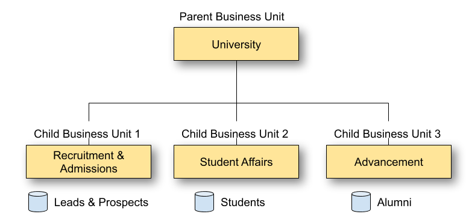

# 1.  Bounced Status?
메일을 편지로 생각했을 때 배달부가 편지합에 던졌는데 들어가지 않은 케이스다. 전송 자체는 이루어졌지만, 이를 받는 Inbox에서 받아들이지 않은 상태를 말한다. 이후에 다른 메일의 링크로 접속했더라도 bouncde된 이메일을 받지 않은 상태로 해당 고객의 상태는 bounced로 남아 있는다.

# 2.  Full Permission 
admin이 사용자에게 모든 권한을 위임할 때 주어야 할 2 가지 권한은 다음과 같다.
* Marketing Cloud Administrator: Marketing Cloud Platform의 모든 특징과 기능에 대해 접속할 권한을 준다.
* Administrator: Salesforce의 모든 특징과 기능에 대해 접속 가능한 권한을 준다.

# 3. SSO(Single sign On)
SSO는 여러 개의 applications에 접속하는데에 있어서 하나의 applications에서만 접속하더라도 다른 곳에서도 접속할 수 있게 해주는 것이다. 보안을 위해서 로그인 정보는 암호화되고 이는 보안에 기여를 한다.

# 4. Einstein Email Recommendation
보안정책으로 아직 국내 산업에 들어오기는 어려움 (slack이 클라우드를 사용하는데 이를 사용하면 민감 정보들이 정책에 위반되어 국내에서 일부 기업을 제외하고는 아직 망설여하는 추세)
Einstein Email Recommendation는 Marketing Cloud의 ai 제품 중 하나로 고객의 행동 데이터를 수집하고 이에 대한 선호도 프로파일을 만들고, 이에 기반한 맞춤형 추천을 제안한다.

# 4-1 Interactive Email form Block
Salesforce email studio의 기능 중 하나로 사용자가 원하는 방식으로 이메일 보내게끔 양식을 제공해주는 기능이다.

# 4-2 Eienstein Content Selection
소비자에게 컨텐츠를 제공하는 Salesforce의 AI 모델이다. Content Builder의 기능 중 하나.

# 5 Contact Builder
data extenstions들 관의 관계를 만들어주는 기능을 하는것이 Contact Builder다.
lists, data views, data extensions, data sources 등의 관계를 맺어주는 것을 말한다.
Marketing cloud UI로 접근할 수 있으므로 API를 통해서만 접근할 수 있다는 것은 틀린 사실이다.
단독 또는 그룹으로 관계를 만들 수 있으므로 단독으로만 관계를 맺을 수 있다는 사실은 근거가 없는 정답지다.

## 6 Cloud admin이 Sales cloud Object를 동기화하고 leveraged(활용)하기 위해서 데이터를 구성하기 위해서는 어디로 가야 할까요?
Setup -> Data Management -> Synchronized Data Extenstions

오답: 
Contact Builder -> Data Sources 이 방식은 외부의 데이터를 연관짓기 위해서 찾아가는 방식이다.

Contact Builder -> Data Extensions ->Synchronized Data extensions
해당 방식은 Sales cloud Object를 편집하기 위한 탐색이지 구성하기 위한 탐색방식이 아니다.

## 7. NTO 사용자는 Parameter Manager를 사용해서 자동으로 링크를 첨부한다. NTO 사용자는 이제 이메일에 Campaign identifier를 옆에 붙이고 싶어하는데 어떤 단계에서 이를 구성해야 하는가?
1. link 
2. email 
3. Account
정답: utm_campaign 값을 구성하기 위해서는 이메일 단계에서 구성해야 한다. 

### 8. Marketing cloud admin에서 이를 켐페인 우승자를 뽑기 위해서 60%를 배제하려고 하는데 이를 위해서는 어떻게 해야 할까요?
1. No more than two paths.
2. Evaluation Period must be 72 hours
3. Run once schedule type.
4. Split activity with a percentage of 40% and 60%
5. Decision split activity with a percentage of 40% and 60%
6. Use the Random Split activity with a percentage of 40% and 60%
정답: Path Optimizer에서 구성원을 어떤 이벤트에서 배제하고 계산하려면 원하는 비율을 가지고 Random Split 기능을 사용해야 한다. 40과 60에 random split이 동시에 이루어져야 한다.

## 9. 기본 Profile center를 사용해서 일어날 수 있는 참사로서 어떤 것이 있을까요? 
> 고객이 밴리스트에 추가되어 마케팅 수신거부 리시트에 등록될 수 있다.

### 10. Marketing Cloud Connection을 완료하기 위해서 Marketing Cloud admin이 Marketing 클라우드 탭으로 탐색해서 통합을 완료하기 위해서 이동했다. 하지만, 해당 admin이 "권한 부족, 당신은 통합 마케팅 클라우드 유저로 등록되지 않았다." 라는 메시지를 받게 된다. admin은 Marketing cloud 를 위한 Appexchange admin 옵션이 활성화 된 것을 확인했다. 해당 문제를 고치기 위해서는 어떤 행동을 해야 할것인가?
1. CRM 구성에서 적절한 유저 매핑을 해야 한다.
2. 마케팅 클라우드 옵션 중 appxchange User option도 활성화 한다.
3. 앱을 통해서 연결되는 권한 허락을 얻어서 해결한다.

### 11. ip warming: 고객에게 마케팅 메일을 보내는 양을 점진적으로 늘리는 것을 말한다. 고객에게 점진적으로 보내는 연락의 양을 늘리는 것으로서 해당 고객에 대한 노출을 늘려 공유하는 정보를 늘리는 것이다.

# 12. transactional email
> 고객과의 주고받음이 있는 이메일을 지칭하는 말로, 고객의 ID를 찾아가는 과정이라던가, 이벤트에서의 당첨을 통한 응답 확인 등이 있다.

# 13. App exchange
>Salesforce에서 활용할 수 있는 앱들을 설치할 수 있는 마켓 스토어

# 14. MFA(Multiple Factor Authentication)
고객에게 암호 이외의 추가 정보를 입력하도록 요구하는 다중 단계 로그인 과정이라고 생각하면 됩니다. 예를 들어 비밀번호를 통한 로그인 이후 지문 인식을 통해서 사용자의 생체 정보를 추가로 인증 과정에 추가하는 방식을 우리는 MFA를 적용한 사례라고 할 수 있습니다.

### Journey Builder란?

고객 라이프 사이클을 관리하는 Marketing cloud의 기능. 즉, 고객이 브랜드에 대한 충성도를 고려, 구매, 사용 및 유지할 때 거치는 단계입니다. 

Journey builder는 마케터가 고객의 요구, 욕구 및 선호도, 인구 통계 및 행동을 기반으로 단계마다 상호 작용을 사용자 지정할 수 있도록 설계되었습니다.

> 고객이 생활하는데 있어서 이게 필요한 상황이구나를 먼저 파악해, 메시지를 보낸다거나 광고를 보여주는 등 상호작용을 하는 기능. 어떻게 게인마다 적절한 타이밍에 문구나 광고를 보여줄 수 있는 지 궁금한데 세일즈 포스는 이를 가능케 한다.

### features of salesforce

### 1. 다른 마케팅 클라우드와 통합되어 중복된 경험이 발생하지 않도록 조절
> Journey Builder는 Salesforce의 Sales Cloud와 Service Cloud와 통합되어 고객의 경험을 원할하게 만들고 모든 시스템의 정보가 다른 시스템과 공유되도록 합니다. 이러한 데이터 연계를 통해서 고객이 경험하는 마케팅 솔류션들이 중복되지 않고 헛되지 않게 도와줄 수 있음

### 2. 고객과의 일대일 마케팅으로 고객 맞춤형 서비스 및 관리를 할 수 있음

Joureny Builde의 접근 방식은 일대일 마케팅이라고도 하며 고객과의 개인화 된 상호 작용을 강조하는 CRM 전략으로, 고객 충성도를 높이고 마케팅 수익을 높일 수 있습니다. Journey Builder의 자동화를 통해 대규모 고객 기반을 위한 개인화된 관계를 더 쉽게 개발할 수 있습니다.

## Journey Builder Entry source
Salesforce 마케팅에서 고객의 journey를 시작은 Entry source를 통해서 시작된다. 이 Entry source는 다음과 같이 7개의 요소 중 하나이다.

> 1. Data Extension
> 2. API Event
> 3. Audience
> 4. CloudPage
> 5. Inbound Chat
> 6. Salesforce Data
> 7. Event

 

### Data Extension
각 고객들의 아이디와 세부 정보들을 담은 테이블이라고 생각하면 좋을 것 같다. 다음 엑셀에세 보이듯이 journey든 email studio든 해당 테이블의 값들을 토대로 작업을 진행한다.

### Data Extension 저장 위치
>Marketing cloud 내 테이블에 저장된 경우 Data extenstion을 Entry source로 사용 가능

### Data extenstion 특징
> 유연하게 사용이 가능하며 마케터가 가장 일반적으로 사용하는 진입 소스 중 하나
> Data extension Filter를 사용하며 Journey에 있는 연락처 중 일부에게만 notification 내지는 상호작용을 하거나, 전체에게 전송 가능
통제 가능
> 'Automation Studio'나 'MobileConnect'에서도 Data extension 사용 가능
- Restrictions: 실시간으로 반응해서 전송하는 것은 불가능
(ex> 비밀번호 찾기, 양식 제출, 영수증 전송 등)

### API Events
1. 저장 위치: 다른 플랫폼이나 시스템에 저장된 데이터를 기반으로 사용
2. 특징
* quick real-time trigger sends(실시간으로 즉각 전송)를 위해 만들어짐
* 제한사항: API가 한번에 하나의 레코드만 보낼 수 있기 때문에 일괄 전송은 불가능

예제>
* 이벤트에 당첨된 고객들에게 쿠폰을 전송하는 기능은 X
* 구매를 완료한 고객에게 영수증 발송 O

### Salesforce data
1. 저장 위치: Salesforce Sales Cloud 또는 Service Cloud CRM에서 생성 또는 수정된 레코드를 기반으로 수신 목록을 생성하는데 사용
2. 3가지 Entry Source Options
* Salesforce Community Welcome: 새로운 커뮤니티 가입자가 있을 때, Experience Cloud와 함께 사용
* Salesforce Campaign: 기존 Salesforce 캠페인 및 켐페인 구성원을 기반으로 journey를 강화하는데 사용됨
* Salesforce Data: 리드, 연락처 및 사용자 정의 개체와 같은 Salesforce CRM의 다른 구독자를 포함함

3. 제한사항: <U>Marketing Cloud Connect를 통해 CRM과 Marketing Cloud를 통합해야 함</U>

&nbsp;

*시험에 자주 출제*

<b> You must first have Marketing Cloud intigrated with your CRM through Marketing Cloud Platform</b>

### Inbound chat message
1. 모바일 채팅을 가지고 있는 서비스에 적합.
2. 입력 소스로 채팅 내용을 사용하려면 <U>WhatsApp 비즈니스 계정 연동 필요</U> 또는 Facebook business 관리자 계정 연결 필요

&nbsp;
제한사항
* 모바일 사용자만 가능하기 때문에 가장 제한적인 입력 소스 중 하나
* 그러나 Whatsapp 메시지를 사용하여 직접 채팅하는 사람들에게는 가장 훌륭한 옵션

### Audience Studio
1. 특징
> 이메일, 모바일 및 광고가 혼홥된 교차 채널 프로모션에 적합
-Journey Builder 내 Audience Studio의 잠재고객을 진입 소스로 사용할 수 있어서 채널 전체의 잠재고객을 타겟팅 할 수 있음

2. Google Analytics 360
* 특징
>Google Analytics와 Salesforce Marketing Cloud 모두에 있는 연락처만 고객 journey에 삽입이 가능

>지정된 대상에게 타겟 메시지나 광고를 보낼 수 있음

>웹사이트 방문자를 리타겟팅하려는 사람들에게 가장 이상적인 입력 소스

* 제한사항
> 가장 큰 한계는 Google Analytics 360이 Marketing Cloud에 기록이 없어 알 수 없는 방문자는 타겟팅할 수 없음

### Cloud Page

salesforce에서 자체적으로 만들 수 있는 <U>노코딩 페이지 개발도구</U>다. 아트 리소스만 가지고 있다면 간단한 페이지를 만들 수 있다고 생각하면 된다.

처음에 이해한 내용은 이러한 퀵 팝업만 만들 수 있다고 생각했지만...

다음과 같이 전체 페이지도 개발 가능하다.

### Event
1. 특징
* 고객 행동 데이터를 사용하여 연락처를 가진 고객  Journey에 삽입하는 진입 소스
* 사용 사례
> 연락처를 가진 고객이 웨비나를 등록할 때

>연락처를 가진 고객이 리뷰를 게시할 때

> 연락처를 가진 고객이 프로모션 메시지 수신을 선택하는 경우

### Audience
1. 특징 
* 다른 소스만큼 사용되지 않지만 Audience Builder의 대상을 여정에 삽입하려는 경우 도움을 줄 수 있음
* Audience는 고도로 타겟팅되고 새인화된 커뮤니케이션에 적합하지 않음

## 15.이메일 인증 방식
이메일 인증 방식에는 세 가지 방식이 존재한다.

1. DKIM, SPF는 비유하자면 사무실의 학위증이랑 같다고 할 수 있다.
이메일의 발신처를 인증 할 수 있는 수단을 넣어서 해당 이메일에 대한 인증을 진행하는 방식이다.

* SPF(Sender Policy Framework)는 발신자의 도메인이 TXT 레코드에 등록되어 전송되는 것을 말한다. 해당 설정을 진행할 경우 발신자의 정보를 확인해 수신자는 해당 발신자를 비교할 수 있으며 메일 필터에서 스팸으로 등록되지 않아 해당 메일의 차단을 방지할 수 있음

* DKIM 메일을 보낸 사람을 암호 키로 비교하여 해당 메일이 유효한지 확인하는 것을 말한다.

2. 마지막 방식인 DMARC는 실패한 이메일을 '스팸'으로 표시하거나 이메일을 전달하거나 아예 삭제하는 등 DKIM 또는 SPF가 실패할 때 메일 서버에서 수행해야 할 작업을 알려줍니다.

> 위와 같은 방식을 통해 Mail deliverity를 높일 수 있음

## 16. Datorama
  마케팅 

## 17. Maketing Cloud Business Unit
> 마케팅 클라우드 내에 있는 팀들이 작업할 수 있는 간단한 작업 스페이스를 말한다. 각 팀원 별로 독립적으로 작업 할 수 있으며, 각각의 데이터를 쉽게 공유할 수 있다.

> 해당 그룹에서 각 유닛은 계층 구조를 가질 수 있으며, 해당 그룹에서의 최상위 계층에 존재하면서 하단의 모든 유닛을 커버하는 유닛을 umbrella unit이라고 말한다.

> 트리 구조와 같이 상단에 존재하는 유닛을 parent unit 하단에 존재하는 유닛을 child unit이라고 한다. 

## 18. Marketing cloud admin이 연락처 중 일부 고객들에게만 메일을 보내기 위한 방법
> Salesforce report를 사용해서 레코드를 filter하면 원하는 범위의 고객들에게만 메일이 전송된다.

## 19. 세일즈포스에서 정의하는 강력한 추가 보안 사항은?
> Biometric authentication

## 20. Journey structure를 복제해서 다른 아이디에서도 해당 저니를 편집하기 위해서 사용해야 될 서비스는?
> Journey Template

## 21. DDOS 공격을 방지하기 위해서 사용 가능한 기능은?
> IDS(Intrusion detection System)

## 22. 모든 구독자에게 연락하기 위해 필요한 키 값은 어떤 데이터인가?
> 18-digit Contact ID

## 23. Marketing Cloud contact Builder에서 사용될 수 있는 속성의 최대치는?
> unlimited

## 24. Marketing cloud automation studio에서 활용될 수 있는 자동화의 종류는 어떤 것이 있을까요?
> Journey Automation

## 25. 몇몇 이메일 전송에서 마케팅 클라우드 플랫폼으로 push back 이 되지 않는 것을 확인 했고 admin이 Marketing Cloud Connection이 정상적으로 작동되고 있는 것을 확인 했을 때, admin은 data extension에서 어떤 것을 확인해야 할까요?
> The send Relationship links SubscriberKey to Subscribers on EmailAddress

## 26. 마케팅 클라우드 Journey 빌더의 기능인 것은?
> Journey Analytics

## 27. NTO는 외부의 데이터베이스를 통해, 매일 주기적으로 Marketing Cloud SFTP에 드롭된다. 하지만, NTO는 데이터베이스에서 예상하는 양만큼의 구독자들에게 전송되는 이메일의 수가 해당 되지 않음을 발견한다. 어떠한 기능을 사용한다면 목표하는 데이터 스트럭쳐로 모든 레코드가 등록됨을 모니터링 할 수 있을까?
> Run Completion within the File Drop Automation

## 28. Automation studio 가 하는 액티비티인 것은?
Data Extract

## 29. Marketing cloud amdin이 지정된 IP에 점점 보내는 이메일 양을 늘리기 위해서(IP warming= 지정된 ip로 보내는 이메일을 사전에 정의된 규칙에 따라 양을 늘리는 것) 작업을 진행하 때, Segmentation의 어떤 옵션이 ip warming과 일치하는가?
> 도메인을 분할함으로써 각 이메일 제공자들의 발송의 수를 줄인다.
Segment by domain to limit number of sends to each email

## 30. XYZ 회사는 Marketing cloud를 활용하여 transactional email을 보낼 때, marketing cloud admin은 어떤 세팅을 고려해서 해당 작업을 진행해야 할까?
1. The frequencies of email
2. The compliacnes with email regulation
3. The integration with the company's CRM System

## 31. Marketing cloud admin은 어떠한 유저도 Marketing Cloud user credentials을 가지고 API에 대한 접근을 원치 않을때, 어떤 보안 정책이 적합할 것인가?

> Deselect 'Enable Username and PAssword for Web Service'

## 32. 이메일 수신 제공에 동의한(subscriber) 사람들의 이메일을 랜딩 페이지에 URL 형태로 안전한게 전송하는 방법에 어떤 것이 있을까?
> Using the CloudPagesURLAMPscript function

## 33. NTO는 비즈니스 유저들에게 Maketing cloud의 사용권한을 확장하려고 할 때, Marketing cloud에서 권한을 직접 수정하는 방법 외에, 확장하려고 할 때, 어떤 기능을 사용하면 될까?
> Distributed Marketing

## 34. Marketing Cloud Admin은 모든 이메일에 UTM을 확장시키고 싶을 때, 얻너 기능을 사용하면 될까요?
> Parameter Manager

## 35. what could be the reason for a customer not receiveing emails from other business units after using the default Profile Center link in Marketing Cloud to unsubscribe?

> The busines unit unsubscribe setting could have triggered an enterprise-level unsubscribe

## 36. NTO wnats a data model in Marketing cloud which will prevent them from duplicationg, or even triplicating, records. How should the unique identifiers of the data model be set up if the MobilePush and Email Channels are used within the same account?
> Strategiaclly control the Contact Key values and tie records together across channels using this key.

## 37. Which of the following is a type of segementation in Marketing Cloud's mobileConnect Platform?
> Geographic Segmentation

> 다른 2개의 옵션 같은 경우는 Mobile 뿐만 아니라 다른 플랫폼에서도 가능하기 때문에 문제가 없다.

## 39. Which of the following is a type of data retention policy in Marketing Cloud?

> Contact Delete

Data extract 같은 경우 데이터를 받아들이기만 할 뿐 저장하지는 않는다.
> Data retention policy~ 데이터 보유 기간 정책

## 40. what is the maximum number of subscribers that can be added to a single list in Marketing Cloud's MobileConnect platform?
> Unlimited

## 41. what does MArketing Cloud authenticate when a user logs in through the user interface?
> IF the user has a valid username and password
> If the user has enabled two-factor authentaication

## 42. Which of the following is a way to measure the success of a Marketing Cloud email campaign?
> All of the above 

## 43. Which of the following is a feature of Marketing Cloud's Content Builder Platform?
> Social media publishing

## 44. MArketing Cloud admin notices out of the last several sends. Send Log data for a recent A/B test send was NOT recorded. How could the admin ensure send data is recorded?

> Send logging is enabeld for the send

## 45. Which of the following is a way to improve email open rates in Marketing cloud?
> Using an attention-grabbing subject line

## 46. What are entry source types for Journey Builder?
> Data extension, Email List, API Event, Data Based event

## 47. What is the maximum number of items that can be included in Marketing Cloud's Content Builder?
> Unlimited

## 48. NTO wants to include a subscriber's email address in a URL paratmeter for a landing page in a promotional email. Which Marketing Cluod feature provides secure transmission of this data? 

> The cloudPagesURL AMPscript function B)The web Analytics connector

## 49. NTO has Marketing Cloud users who need data extension View and Update permissions for campaigs realted to B2C sales, but not any permissions for campaigns related to B2B sales. How should they accomplish this?

> Create Seperate folders and add permissons

## 50. Markteting Cloud admin is tasked with requesting Marketing Cloud Connect Multi-Org enablement. What consideration should be given to the preference/profile centers for this integration?

> Profile/ preference centers are automatically created for each business unit connected through Multi-Org

## 51. NTO installed Query Studio for Marketing Cloud, however users are reporting they do NOT have access. How should the Marketing Cloud admin ensure users have access? 

> Allow access package access on appropriate roles

### 52. NTO runs a nightly automation consisting of a File Transfer and a File Import. Following an update from the engineering team, the automation begna failing. The marketing Cloud admin suspects the CSV file now has an invalid format. How could the admin receive a file of the bad data rows to confirm this theory? 
> Move the File Transfer to its own automation and include a notification email address.

### 53. A user is unable to send an email in Marketing Cloud and asks the admin to review their permissions. Upon review, the admin sees that the user has been assigned three roles: Content Creator, Data Management, and Marketing Cloud Viewer. What action should the admin take to reolve the issue and aloow the user to send an email?
>Edit the user's permission to include the 'Send' Permission

### 54. NTO hired a new Marketing Cloud admin, who wsa told all emails come from [email protected] The previous admin did not leave any documentation. What should confirm a Sender Authentication Package(SAP) has been set up on the account?

> Upon receiving an email, all tracked links start with click. email.not.com.

## 55. Which of the following is a feature of the Social Studio platform? 
> Social Listening

## 56. A marketing Cloud admin is asked to understand how a certain content area within a Triggerd Send Email is performing . Which report should be used?
> Impression Tracking for Triggered sends

## 57. Which activity should be used for Multivariate content testing within Journey Builder?
> Decision Split

> when it comes to testing activity should, we should test with the outcome from variate testing material, not with the inputs. So the answer is Decision split not Engagemnet Testing

## 58. A service CLoud admin runs a report to see the total number of cases in their, but the number seems lower than expected . They have  50,000 open cases and 10,000 closed cases. Why would the total casese lower than the sum of open and closed cases?
> Some cases may have been deleted or merged

## 59.NTO wants a business analyst to import contact lists. The anlaytics has the following Marketing CLoud roles: Marketing Cloud Channel Manager and Marketing Cloud Viewer. the analst logger in but is unable to import contact lists. How should the user be updated to allow the analyst the appropriate aceess?
> Add marketing Cloud Security Administrator

## 60. Which of the following is a feature of Marketing Cloud's Data Designer?
> Data modeling

## 61.  Maketing Cloud admin wants to exclude certain Contacts from a extension before sending an email. What should the admin do to ensure only specific Contacts are included in the email?

> Filter records on a Boolean field

### 62. A new employee is hired into the role of marketing analyst. This user should have acess to all tracking data in Marketing Cloud,But no access to any send activities. Which two default User Role should be applied to this new user which provides this access to all channels, keeping the arinciple of least privilege in mind?

> Data manager and Markeing Cloud viewer

## 63. Maketing Cloud admin wants tot automatically unsubscribe customers who respond to marketing emails asking to be romved from the mailing lists. Which step hould the admin take to enable this functionlity?
> Select Unsubscribe Manual Requessts in Reply Mail Management

## 64. NTO wants to use Synchronized Data Sources to sync Contact data from Salesforce CRM. However, they only want to sync records they would be able to send to reduce the amount of data being brought over. Which filtering option could be used when configuring the Contact synced object?

>  Select all records where HasOpted OutofEmail is FALESE

## 65.  What is the maximum number of columns that can be added to a single data extension in Maketing Cloud?
> Unlimited 

## 66. NTO wnats to decrease its Session Timeout from 8 hours to 20 minutes. Where should this update be made?

> Setup > Security > Security Settings

## 67. Marketing Cloud admin is configuring Social Studio to manage social media accounts. What prerequisite for configuring Social Studio should the admin consider?

> Access to social media accounts

