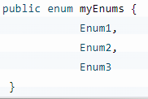

# APEX 기초
Ligtning Platform은 너무나도 메타데이터 구조에 의존하고 통합되어 있기 때문에 declarative development와 클릭을 통한 개발이 이루어짐을 알 수 있다. 개발자의 입장에서 코딩이 얼마나 재미 있는지 알지만, 세일즈포스의 사상에서 코딩은 과정의 일부일 뿐 필수로 들어가는 영역이기 때문에 도구 중 하나라고 생각하면 좋을 것 같다. 회사의 생산성 면에서 더 빠른 작업을 원한다면 코딩에 골매이기 보다는 생산성 면에서 노력하는 것이 좋을 것이다.

# 객체 지향적 설계
형태를 본다면, Net 프레임워크를 경험해본 개발자라면, C#과 매우 유사한 형태임을 알 수 있을 것이다. C#을 경험해보지 않았더라도 Java와도 매우 유사한 면이 많기 때문에 그렇게 어렵지 않게 접근할 수 있을 것이라고 믿는다.

# Apex 자료형 구분
Apex는 크게 두 가지로 분류 될 수 있다. 첫 번쨰로는 Primitive type가 존재하는데 예로는 Integer, Double, Long, Data, String, Boolean 등이 있다. 또 다른 분류로는 ID type이 존재하는데, 18개의 공간에 어떤 형태의 데이터든 넣을 수 있는 형태를 말한다.

> 값과 참조 타입은 똑같이 작용하지만, Apex에서는 <b>모든 변수는 null로 초기화된다.</b> 그리고 또 하나 주의할 점은 String 타입의 변수가 value 타입과 같이 작용한다는 점이다. 

## 1. Integer: 32 bit 정수
>apex는 int 가 없음, multi tenant라

ex
> Integer i= 1;
## 2. Decimal: 28자리~38자리로 최대로 할 수 있는 소수점 변수

ex
> Decimal dec= 1.34561231;

## 3. Long: 64 비트 정수

ex
> Long long= 113156456123;

## 4. Double: 64 비트 소수

ex
> Double num= 1.123213123;

## 6. Blob : 2진법으로 데이터를 저장하는 변수

ex
> Blob num= 1010111(2);

## 7. String: 문자열

> apex는 char 과 string의 분간이 없음

ex
> String str= 'Apex';

## 8. Boolean: 걍 불린

> Apex에서는 신기하게도 Boolean에 null이 포함될 수 있음
기계어를 까봐야 알겠지만, 참 신기함

ex
> Boolean value= true;

## 9. ID

> Apex의 특이한 변수 중 하나, 숫자는 문자든 18개 안에서 들어갈 수 있는 형태

ex> Id id='10231223156asdasdd'

## 10. Object
> Apex에서 지원되는 모든 데이터 타입

단, 어떻게 메모리가 할당될지 모르니, 아껴쓰는 것이 좋긴 함
예를 들어 Blob 같은 경우는 Object보다는 Blob를 쓰는게 훨씬 낫듯
메모리적으로 깔끔한 면이나, 코드의 가시성인 면에서 Object 사용은 객체지향 설계 측에서 생각했을 경우에만 하는 것이 좋다.
ex
> Object obj =10;

## 11. Data, Datetime, Time
> Only day, day and time, only time

## 12. enum
> 기존의 enum과 다르게, 값에 대한 초기화를 하지 않고 선언을 한다. 변수를 선언하게 되면 

> 만약, 값을 정의하고 싶다면 다음과 같이 값을 정의 해 주어야 한다.

> Integer enumOrd=myEnums.Enum3.ordinal();

## 13. List

String으로 된 리시트 선언의 예제
> List<String> myStrings=new List<String>();

객체를 정의하듯이 선언을 해주어야 하기 때문에, 까다로움이 조금 있다.

또, 다른 방법으로 myStrings를 선언하게 된다면, 다음과 같이 선언하게 된다.
> String[] myStrings=new List<String>();

또, 다른 대체 방법으로 리스트를 만든다면 값들을 다음과 같이 초기화하면 된다.
> List<String> myStrings=new List<String> {'String1','String2','String3'};

또, 다른 대체 방법으로 C++에서 vector를 사용해서, 값을 스택 방식으로 추가 하듯이

List<String> myStrings=new List<String>();
mystrings.add('String1');
mystrings.add('String2');
mystrings.add('String3');

많은 Lightning Experince를 테이블과 연결하면서 SOQL 쿼리문을 사용하게 해당 쿼리문을 통해서 불러온 데이터는 사실 리스트의 형태로 가져와진다. 예를 들어 다음과 같이 리스트를 선언할 수 있다.

List<Account> myAccounts=[SELECT Id, Name FROM Account];

이것도 마찬가지로, 배열과 같이 인덱스의 시작은 0으로 시작되기 때문에 다음과 같은 방법으로 첫번째 계정에 접근할 수 있다.

> List<Account> myAccounts=[SELECT Id, Name FROM Account];

String firstAccount=myAccounts[0].Name;

## 14. Set
Set은 원소들을 순서 없이 저장하는 형태의 자료구조다. 또, 중복 원소를 가지고 있지도 않다. 그렇기 떄문에, 보통은 <b>계정 ID 값들을 담는 요소로 많이 사용된다.</b>

> Set<ID> accountsID =new
&nbsp;&nbsp;&nbsp;Set<ID>{'001d000000BOaHSAA1','001d000000BOaHTAA1'};

> List<Account> accounts=[SELECT Name FROM Account WHERE Id IN :accounIds];

## 15. Map
키-값이 역인 구조의 자료구조 형태다. 각 key 값은 하나의 값과 연결된 값이다. 당연히 키 값은 고유한 값으로 되어 있어야 하고,  예시로 보면

> Map<Id, account> accountMap =new Map<Id,account>([SELECT Id, Name FROM Account]);

> Map<Id, segment> CollectionID=new Map<Id, segment>([SELECT Id, Segment FROM CDP]);

다음과 같이 Map을 선언하는 문장을 했을 때, 

