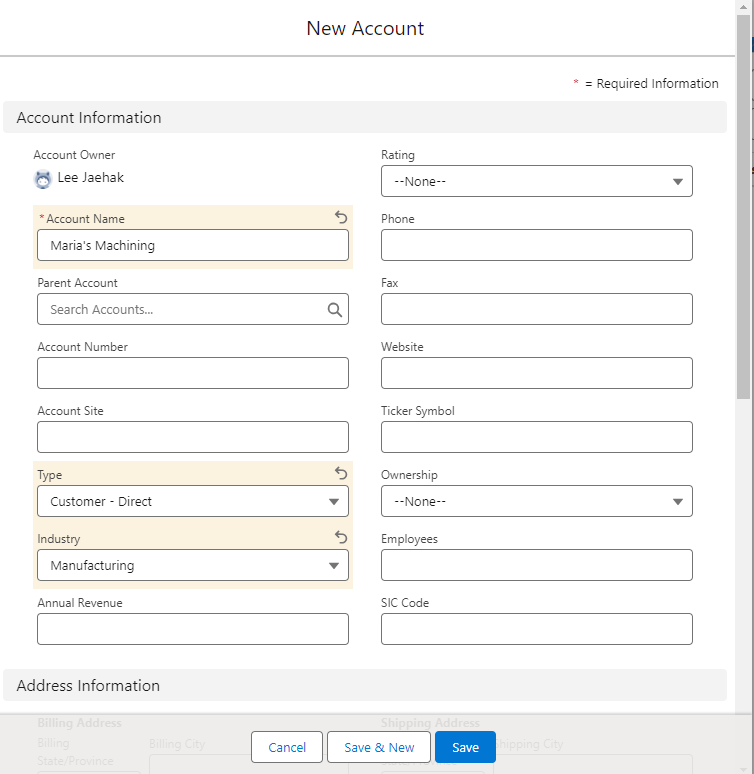

# 고객 정보 추가
> 영역을 하다 보면 영업활동을 통해 얻은 고객에 대한 데이터를 저장하고 이를 아카이브 할 필요가 있다.

다음과 같은 방법을 통해 우리는 세일즈포스 내에서 고객의 인생에 대한 단편적인 정보들을 추가하고 이를 회사의 Data resource로 관리 할 수 있다.

Home-> Sales -> 화면 상단의 네비게이션 바에서

> accont 클릭 -> new account

다음과 같이 고객 이름을 추가하고, 고객에 대한 단편 정보들을 추가할 수 있다. 

# 고객 연락처 추가

Contacts 탭에서 new 클릭