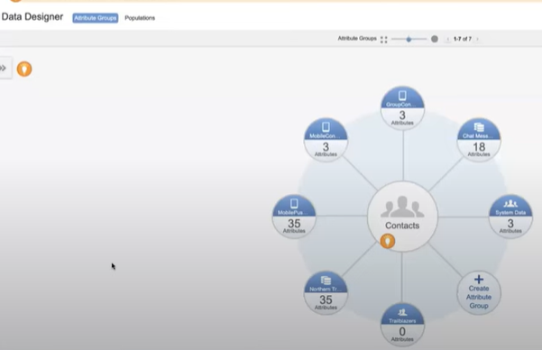
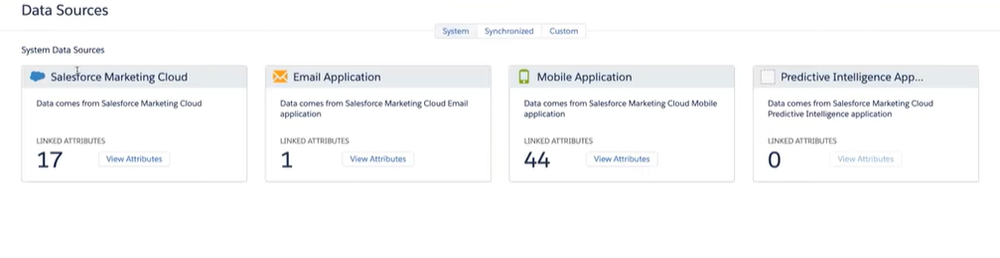

# Contact Builder

* Contact contfiguration 
> contact builder가 import된 데이터를 어떻게 처리할지를 결정하는 단계

* Data Designer

> data extension을 contact에 연결시켜, 연락처와 해당 DE의 정보를 정의하는 툴

* Data extensions
> 연락처를 저장할 DE를 따로 만듦

* Imports
> Create the processes that move contact Information into your data extensions

* Data sources
> Visualize where your contact data originates and assign attributes to those sources

## Data Sources types

1. System
> Marketing cloud에서 디폴트로 만들어주는 Data structures

2. Synchronized
> google 360, sales cloud, service cloud 등등 세일즈포스 기관에서 들어오는 데이터를 인입하는 DE (google 360은 예외임)

3. Custom 
> 외부 기관, API 등등의 외부 기간계에서 오는 데이터 소스
