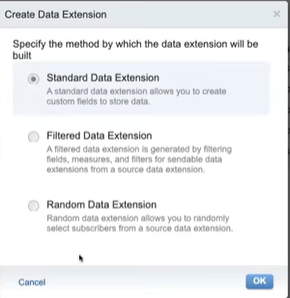
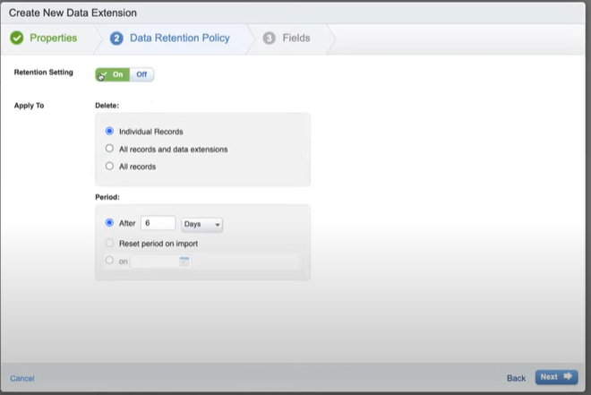

# Data Extension
List는 고객에 한해서만 데이터를 담을 수 있었다. 반면, data extension에 한해서는 

## Data extension tyoe

1. Standard
> 커스텀 필드를 가진 데이터 셋을 만들고 싶을 때

2. Filtered
> 기존에 존재하는 데이터를 가지고 어떤 조건이나, 부분집합으로 만들기 위한 data extension

3. Random
> Data extension에 있는 subscribers 중 랜덤으로 한 명을 골라서 사용할 수 있게
한다.

### sendable
subscriber와 맵핑 관계를 가지는 data extension을 말하는데, 이관계를 sendable이라고 지칭하단. 전송을 하면 해당 DE에 있는 contact는 all contact에 추가된다.

### Nonsendable
날씨, 항공편 번호, 주문, 제품 등등 고객과 직접적인 연관이 없는 데이터들을 
저장하는 저장소로 DE를 사용할 때, 다음과 같이 DE를 non sendable 관계로 설정한다.

# Data extension 자료형

1. Text
2. Number: int라고 보면 됨
3. Boolean: 
 * True: 1, Y,Yes, true
 * False: 0, N, No, False

4. Data: YYYY/MM/DD가 default 뒤에 HH:MM 추가 가능
5. Phone: 15자리의 숫자만을 받는 문자열, 숫자이외의 문자는 받지 않는다.
6. Email: email을 보내는 DE에서는 필수값
7. Locale: ISO 언어이며 국가코드
8. Deciaml: 정수값을 precision이라고 부르고, 소수점 뒤의 부분을 scale 이라고 부른다. 

## Data extension 생성 시 유의사항
1. 너무 많은 DE를 만들지 않게 유의 (가시성)
2. import 하는 데이터와 자료형이 일치하는지 유의
3. sendable DE는 하나의 이메일 필드가 있는지만 확인
4. filtered data extension은 몇몇의 기준 안에서는 sendable data extension이 될 수 있다.
5. Subscriber key는 텍스트만 가능하다.

## Data retention setting
retention setting 
-> on 

다음과 같이 하단에 apply to 영역이 활성화

# Retention delete option
1. Individual Records
2. All records and data extensions
3. All records

retention can be reseted with the option called
> reset period on import

### Trackings are only available on Email studio

### In contact builder you can add single record in DE, but can't be happened in email studio

###
