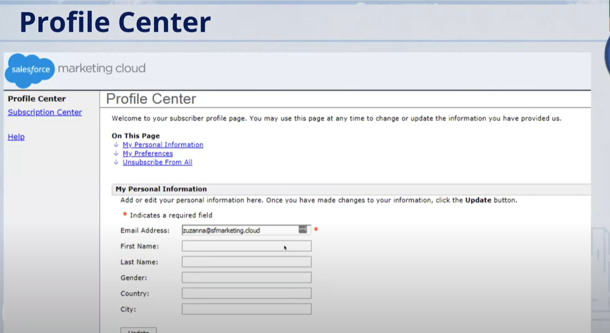

# exam guide
* Given a scenario, describe the contact model
* Given a scenario, evaluate data quality
* explain preference and profile center concepts

# Subscriber 
A person who opted in to receive communications from your organization

# Contact
> An individual added to any contact database within your Marketing Cloud instance. 

> A contact is also any other individual to whom you sent a message via any channel using Marketing Cloud.

## Difference?
All subscribers are Contact, but not all contacts are not subscribers

# Subscriber Key
A value that uniquely identifies a subscriber in your Marketing Cloud account
마케팅 클라우드 내에서 고객을 식별하는 유일한 키 값, <u>발송이 되어야 subscriber 키를 발급을 받음</u>

English Charactor only and <u>Shouldn't contain email address<u>

# All Subscriber List
* Master List of records for the marketing Cloud Email Studio account
가는 방법 
> Email studio-> Subscribers -> All subscribers

>이메일 스튜디오의 마스터 레코드
* Every Subscriber in your account appears on it
>계정의 모든 subscriber들이 포함되어 있음
* Contains email address, subscriber key & status + any optional attributes that have been created
>이메일, subscriber key, 상태 등등 고객에 대한 모든 세부정보들이 포함되어 있음
* Subsribers stored on data extensions join the All subscriber list when you send your first message to that subscriber.

* If a subscriber is unsubscribed in the All subscriber list, the subscriber is unsubesribed from all lists and groups
> all subscribers list에서 제거된다면, 모든 리스트나 그룹에서 제외된다.

## Subscriber key vs contact key
contact builder-> all contacts 
contact란 마케팅 클라우드 내에 있는 모든 고객에 대한 record를 칭하는 말이다. 그렇기 때문에, Subscriber key는 contact 키에 종속 관계라고 볼수 있다. All contact라는 집합 안에 Subscriber key가 포함된다.

# Profile Attributes
subscriber와 연관된 데이터들을 profile attributes라고 할 수 있다.
ex> First name, Birthday, Favorite color, 연락처 등등

# Preference Attributes
boolean value (yes or no로만 대답)

> 가는 방법 
email studio -> subscribers -> preference management

# Profile Center

> 가는 방법 
email studio -> subscribers -> profile management

### Pulbic list
> if customer couldn't see publication lists that admin has made, check sure if publick list checkbox has been selected

> 고객이 admin이 만든 publication list를 확인하지 못한다면 해당 list에 public list 옵션이 체크되지 않을 수 있다.

###  

