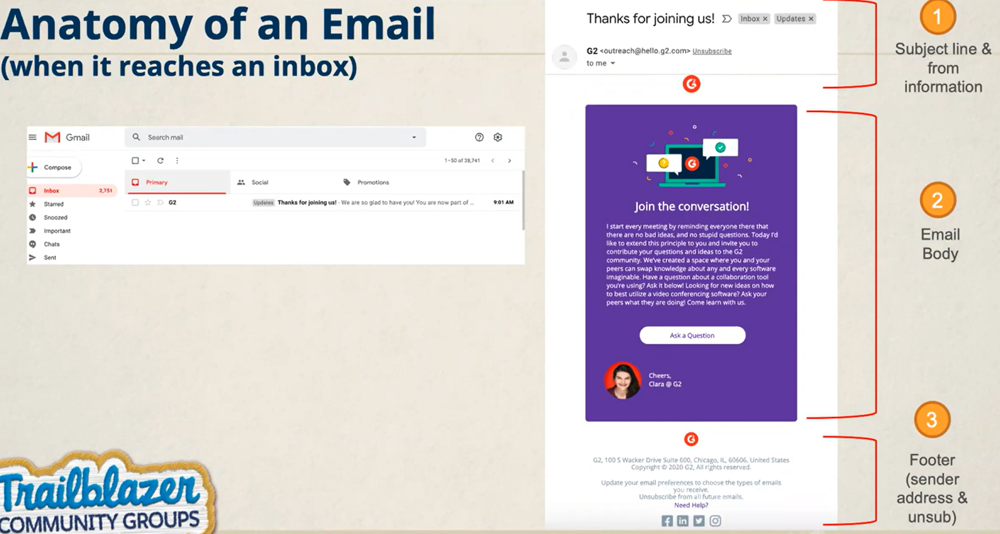
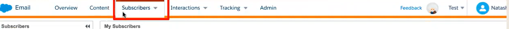

# Anatomy of an Email

# name& email address 설정 
이메일의 이름, 주소 설정은 marketing cloud setup에서 설정한다.

# Email creation
content builder를 통해 생성한다.

# Data extension 과 email Creation
email studio를 통해 작업한다.

# Content Builder
1. 마케팅 클라우드의 컨텐츠(이미지, 문서, 컨텐츠)들을 cross-channel로 관리할 수 있는 tool이다.
2. 드래그 앤 드랍 인터페이스
3. 사용
* assets(images, doc, code) 등을 불러오는데 사용된다.
* 재사용 가능한 template을 만드는데 사용
* Content block을 만드는데 사용
* email template(html paste 또는 템플릿 사용)

# business unit 공유 설정
* local 
> 하나의 계정이 두 개의 회사 법인에 영속되어 있다면, a라는 회사 (business unit) 에서만 볼수 있는 asset 저장소

* shared
> 하나의 계정이 두 개의 회사 법인에 영속되어 있다면, a라는 회사 (business unit) 에서만 볼수 있는게 아니라 b라는 회사에서도 볼 수 있는 assets

# Email studio
build and send personalized email from basic newsletters to the most complex campaignsd. 
보낼 수 있는 이메일은 다음과 같이 종류를 가진다.
1. promotional campaigns
2. transactional campaigns
3. triggered emails

그리고 이 모든 발송에 대해서 추적과, 최적화가 가능하다.

* 사용법
1. Data extension과 lists 생성 (Data models)
2. lists나 Data extension에 데이터를 import하는데 사용할 수 있다.\
3. testing emails (테스트 발송과 이메일 미리보기 가능)
4. sending emails (single-sends, user-initiated emails, A/B test) 
5. tracking email performance (이메일 발송률 추적)

## Email studio tab

1. overview
2. content
3. Subscribrs
4. Interactions
5. Tracking
6. Admin

### content
content builder로 이동하는 방법
email studio -> content 를 통해 이동이 가능

### Subscribers 
이메일 스튜디오에서 발생하는 데이터에 대한 관리가 이루어지는 곳
list, data extension, publication lists, filters, measures 생성 가능

### Interactions
automated activities and tasks, 사용자 trigger로 발생하는 이메일(수동으로도 가능),trigger 발송

### Trackin
이메일 발송에 대한 결과를 보는 곳 
모든 발송은 추적이 되고 
* open rates
* CTR
* deliverity rate
* bounce rate
* unsubscribe rate
 등을 확인할 수 있다.