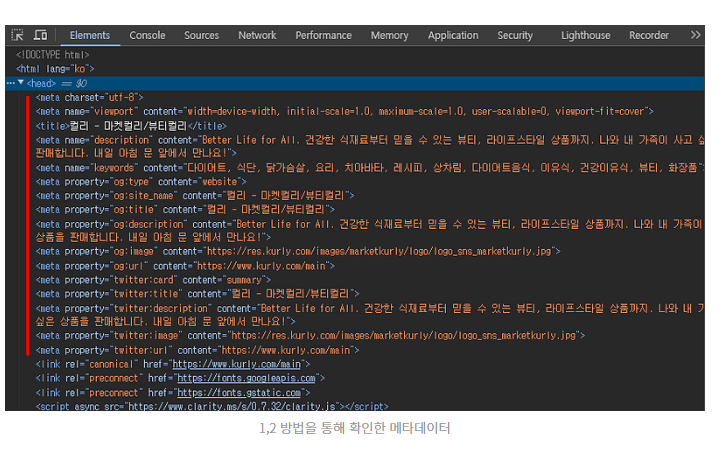
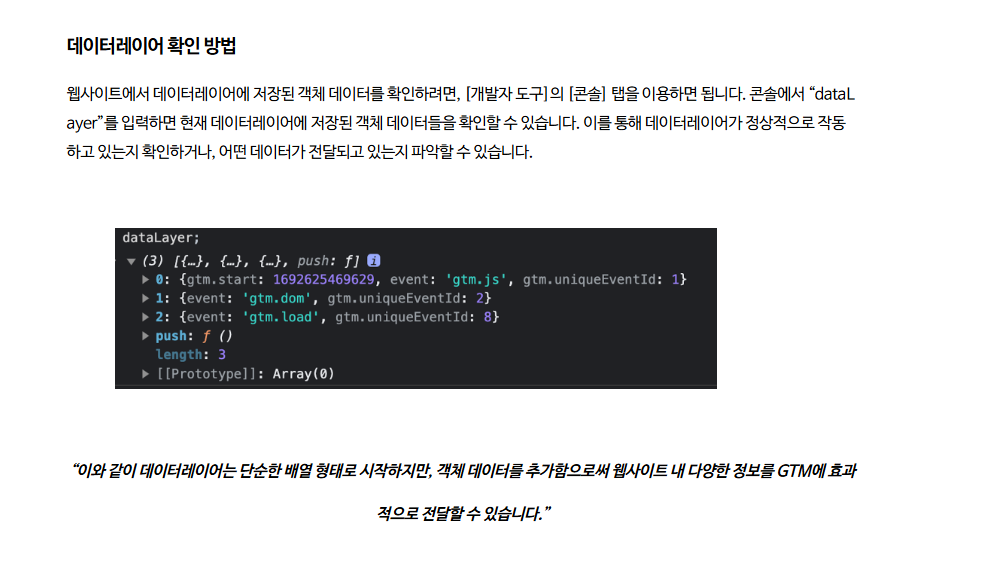

# DOM
MCP 에서는 dom ready라는 트리거가 존재하는데
이를 적용하기 위해서 DOM에 대한 공부 진행

# DOM 이란?
Document Object Model 문서 객체 모델의 약자로 HTML, XNL 문서의 프로그래밍 인터페이스이다.

즉, 이와 이런 다큐먼트로 작성된 부분을 JS나 DOM을 통해 변경이 진행된다고 보면 된다.

초창기에는 JS와 DOM은 밀접하게 연결되어 있었지만, 나중에는 각각 분리되어 발전해왔다. 페이지 콘텐츠는 DOM에 저장되고, JS를 통해 접근하거나 조작할 수 있다. 

# API(web or XML Page) = DOM + JS

DOM은 프로그래밍 언어와 독립적으로 디자인 되었다. 
Dom은 트리 형식의 구조라고 볼 수 있다. b 나 br 로 계층이 나늬며
각 문서를 오브젝트로 정렬한다.

# 어떤 카탈로그 데이터를 수집해야 할까?
salesforce 가이드 라인을 보면 웹사이트 내에서 3종류의 데이터를 수집할 수 있는데 이중 2개를 사용하는 것을 권장한다.
* meta data
* Data layer
* 소스 코드

이 중 meta data와 웹 data layer가 신뢰갈수 있는 웹사이트 정보라 이를 사용할 것을 권장한다.

### 데이터 레이어

https://www.openads.co.kr/content/contentDetail?contsId=14136