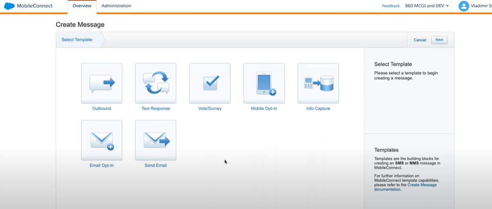
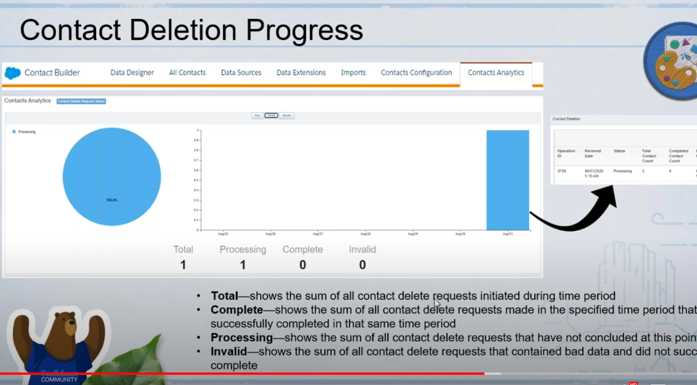

https://www.youtube.com/watch?v=EQU7wrFbZRM&list=PL_o00w2Z5LYEt646E-F5IOfYsWs1SecEQ&index=2

# Mobile studio
* for usage of messaging
* MobileConnect
 > For SMS/MMS messaging

 > For sms and MMs

* MobilePush
 > Mobile App push engagement

* GroupConnect
 > For chat app messaging app
 
 > send personalized, time-sensitive message

 

# Web studio
* Deliver Content Across Channels

* create & pulbish targeted marketing experience

* Create pages that drive actions
> complete full digital marketing caampaigns from acquistion to retention

# Smart campture 
* gatehr data, trigger customer journey, and grow your subscriber base

* Build a landing pages and microsites

* Engage
> Leverage MobilePush Pages to connect with your most loyal customers in a personal ways

# Social Studio
* Listen to your social communities
> Spot trens, analyze sentiment, and keep you finger on the pulse of the conversation

* publish in real time 
> update social networks with the latest information. Analyze the impact and resonance with Einstein powered insight like sentiment

* Engage your social community
> Join the social conversation in real-time. Triage & prioritize posts

# Mobile connect configuration page

# Contact key 
unique identifier for a contact in Marketing cloud -user defiened

* email
* EMP -0012321
* 00213123 

these 3 could be contact key

# Subscriber key
unique identifier for a contact in MC
> contact key=subscriber

# Channel identifiers
* Email studio: email addresses
* Mobile connect- Mobile ID
* Mobile push- Device Id

# Contact  ID 
Unique Identifier for a contact in Marketing Cloud

All contacts 
* when you send communication to a contact, they get added to all Contacts
* You can have contacts added to All contact through Marketing Cloud Channels, synchronized Data Sourcees, API Calls and File Imports
* 또, 마케팅 communication을 하지 않은 고객이라도 contact에 있을 수 있음. (Data cloud -> Makreting cloud)

Email studio VS Contact Data Linking
> Use Data Realationship for linking Data Extension- cannot use Contact Data

All other channel apps -use attribute froups in Contact Builder for linkin data extension
> user attribute groups linkage for linking data to Contact

# Contact Deletion

Defaul it 14 days

# contact deletion progress

* total: shows the sum of all contact delete requests initiated during time spent

* Complete: shows the sum of all contact delete requests made in the specific periood

* Processing: shows the sum of all contact deltet requests made in the specific time priod

* invalid

# Contact Delete location

-> Contact configuration -> contact Delete

# Parameter managament
* Set up or edit the tracking parameter that are apeended to ther links in message sent

* Parameters you configure here are applied to all messages sent from your business unit

* Before using the Parameter Manager, activate the Webanalytic connector in your account