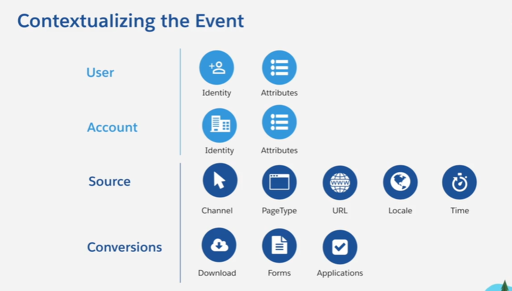
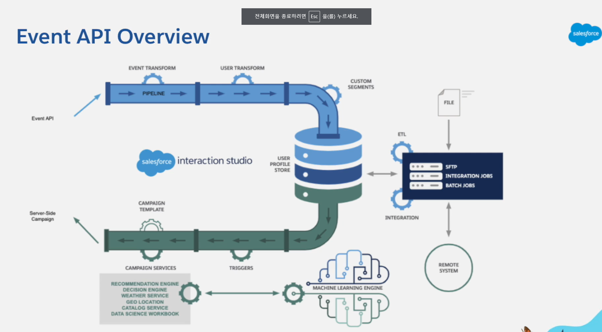
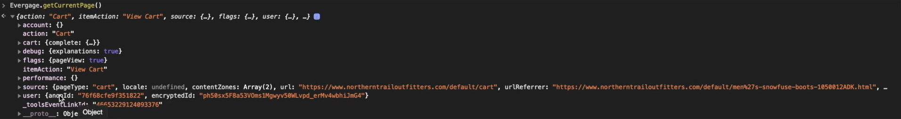

# Events
소비자가 서비스에 접속한 순간 cookie 또는 beacon을 통해서 Personalization에 전송되는 json 형식의 API를 지칭하는 말

해당 API를 통해서 수집될 수 있는 데이터는 다음 이미지와 같다.

# Event API Overview
이벤트 API가 전송되는 과정

# 크롬 InfoBar Message Text에서 다음과 같이 
> Evergage.getCurrentPage() 
명령어를 입력하면 다음과 같이 해당 웹페이지에서 가기고 오는 JSON 파일의 형식을 파악할 수 있다.

하지만, 이렇게 명명하더라도 json 파일을 뜯어 보지 않는 이상, 사용자의 행동 데이터가 제대로 수집되는지 검증되기는 어렵다. 
그래서, 검증을 하기 위해서는 다음과 같이 2가지의 방법을 통해서 검증이 가능하다.

# Server_side campaign response that could be included

* attribute
* Segment Memebership
* Recs
* Next Best Offer/Action