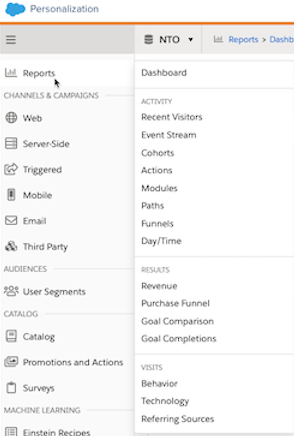
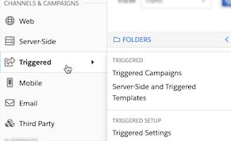
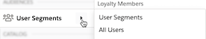
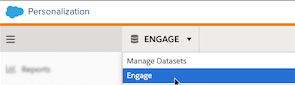
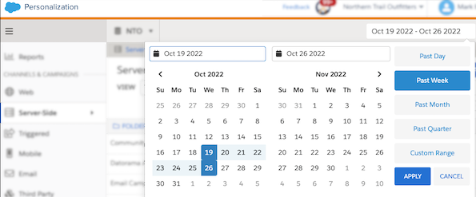
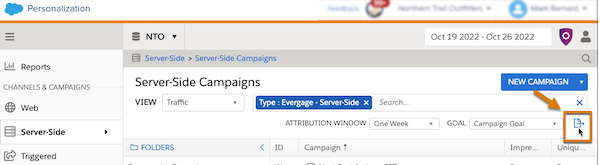
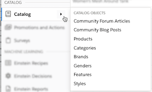
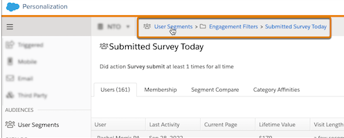

# Navigate Personalization
MCP에 들어갔을 때, 사용자의 인터페이스에서 원하는 항목으로 접속하기 위해 도와주는 네비게이션 툴이다.

### Design and Layout
통상적인 사이드 네비게이션 바처럼 최좌측에 메인 네비게이션 바가 존재하고
해당 메인 네비게이션 바에 항목을 선택하면 사이드 내비게이션 바가 메인 바 우측에 뜨게 된다.

<네비게이션 바>

### Channels & Campaigns
주로 고객과 소통하는 방식들이 나열된 곳으로, 상단부터 web, server-side, triggered, mobile, email, Third Party 등이 존재한다. 해당 텝들에 마우스를 올려 놓으면 해당 텝에 속해 있는 세부 기능들을 사용할 수 있게끔 우측에 서브 네비게이션 바가 펼쳐지게 된다.

### Audience

고객과 고객의 계정으로 정제된 segments들을 audience 탭에 있는 User segment에서 확인이 가능하다. 사전에 정의된 고객들의 attributes들부터 전환율, life-span 구매에 대해서 확인이 가능하다.

### Dataset Selector

MCP에서 데이터들을 통합하는 단위를 DataSet이라고 부른다. 보통은 1개의 데이터셋을 가지고 운영하기 때문에 해당 인터페이스에 대해서 굳이 알아야 할 필요는 없지만 여러가지의 특성에 대해서 personalization을 적용하고 싶다면, dataset을 여러가지로 둘 수 있고 다음과 같은 드롭 다운 바를 통해 dataset을 교체해서 볼 수 있다.

### Date Picker

위에서 말한 dataset에서 대시보드를 조회할 때, 일자별로 데이터를 정리해서 보고 싶다면 하단의 그림에서 보이듯이 Date Picker UI를 통해서 대시보드 조회를 수정할 수 있다.

조회할 수 있는 기간의 옵션은 주, 일, 월, 분기까지 가능하며 Custom Range를 사용한다면 쿼리문을 통해서 사용자가 원하는 기간 별 집계를 볼 수 있다.

### Campaign Export

만약 만든 켐페인에 대해서 서면으로 데이터를 확인하고 싶거나 다른 가시화 라이브러리를 통해 조회하고 싶을 때, Campagin export 기능을 통해 만든 캠페인을 CSV 파일로 추출이 가능하다. 하단의 이미지에서 보이듯이 캠페인 대시보드 페이지 우측 상단의 문서에 우측으로 화살표가 나가는 버튼을 클릭하면 CSV 파일로 해당 켐페인을 다운 받을 수 있다.

### Catalog

catalog 컨텐츠에 대해서 왼쪽 네비게이션 바를 통해 빠르게 접속이 가능하다. catalog는 우리가 생각하는 캐탤로그로 해당 catalog 대시보드로 이동해 해당 catalog와 매핑된 데이터들을 조회가 가능하다.

### BreadCrumbs
윈도우 탐색기처럼 원하는 계층의 대시보드로 이동해 데이터를 조회가 가능하다.

